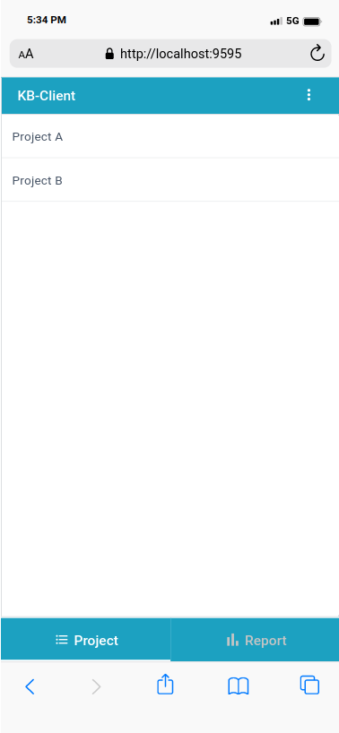
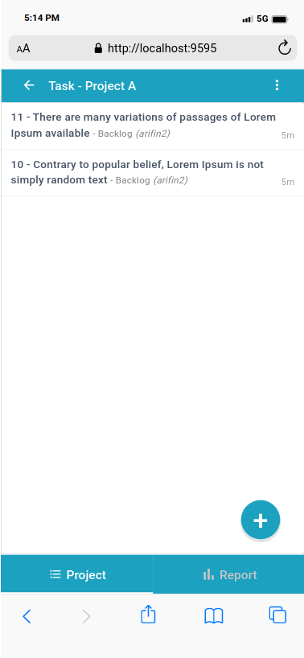

# KB-Client - Kanboard Frontend

[Kanboard](https://kanboard.org/) frontend UI powered by Webix

### Screenshot

|  |  |  |
|---|---|---|


### Installation

#### 1. Build app
```
npm run buildconf --endpoint=http://your-kanboard-endpoint.com
```

#### 2. Copy all inside `www` folder to your webserver app
Ok done, run


or

#### Using Docker
```
docker run --rm --name kbclient -p 8085:80 -d -e "API_SERVER=http://localhost/kanboard" finzaiko/kb_client:1.0
```
and open in browser: `http://localhost:8085`
### Try on development

Clone this repository and run:
```
npm i
npm start
```


### API Modification

#### 1. Allow cross origin

Replace `<rootpath>/jsonrpc.php` to this:

```php
require __DIR__.'/app/common.php';

header('Access-Control-Allow-Origin: *');
header('Access-Control-Allow-Credentials: true');
header('Access-Control-Allow-Methods: GET, POST, PUT, DELETE, OPTIONS');
header('Access-Control-Allow-Headers: ACCEPT, ORIGIN, X-REQUESTED-WITH, CONTENT-TYPE, AUTHORIZATION');
if ("OPTIONS" === $_SERVER['REQUEST_METHOD']) {
    die();
}

echo $container['api']->execute();
```

#### 2. Update extendedQuery

Change extendedQuery to addional usefull field method in `kanboard/app/Model/TaskFinderModel.php`

```php
 public function getExtendedQuery()
    {
        return $this->db
            ->table(TaskModel::TABLE)
            ->columns(
                ...
                ProjectModel::TABLE.'.name AS project_name',
                ...
                'uc.username AS creator_username', // <-- new
                'uc.name AS creator_name' // <-- new
                )
            ->join(UserModel::TABLE, 'id', 'owner_id', TaskModel::TABLE)
            ...
    }
```

#### 3. Update get task query

Change getAll method in `kanboard/app/Model/TaskFinderModel.php`
to this to get all available joined data
```php
public function getAll($project_id, $status_id = TaskModel::STATUS_OPEN)
{
    return
        $this->getExtendedQuery() // <-- new
        ->eq(TaskModel::TABLE.'.project_id', $project_id)
        ->eq(TaskModel::TABLE.'.is_active', $status_id)
        ->desc(TaskModel::TABLE.'.id') // order last update on top
        ->findAll();
}
```

#### 4. Update get task by id query

Change getAll method in `kanboard/app/Model/TaskFinderModel.php`
to this to get by id joined data
```php
public function getById($task_id)
{
    return  $this->getExtendedQuery() // <-- new
        ->eq(TaskModel::TABLE.'.id', $task_id)->findOne();
}
```
